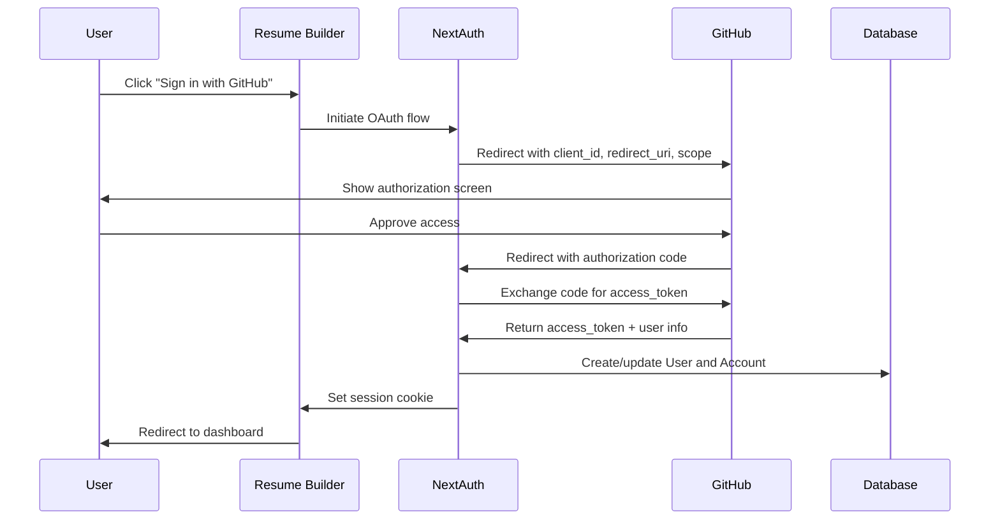

# Authentication

This document explains the authentication implementation using NextAuth.js v5, including OAuth flows, session management, and security considerations.

## Overview

ResumeBuilder2026 uses NextAuth.js v5 (also known as Auth.js) for authentication. This provides:

- GitHub OAuth integration
- Session management (JWT-based)
- CSRF protection
- Secure cookie handling
- Database integration via Prisma adapter

## OAuth 2.0 Flow Explained

Understanding OAuth is essential for working with authentication. Here's what happens when a user signs in:



### Step-by-Step Breakdown

1. **User initiates sign-in:** Clicks "Sign in with GitHub" button
2. **Authorization request:** App redirects to GitHub with:
   - `client_id`: Identifies our application
   - `redirect_uri`: Where GitHub sends the user back
   - `scope`: Permissions requested (email, profile)
   - `state`: CSRF protection token
3. **User authorizes:** GitHub shows what permissions the app requests
4. **Authorization code:** GitHub redirects back with a temporary code
5. **Token exchange:** Our server exchanges the code for an access token (server-to-server, code never exposed to browser)
6. **User info:** Server uses token to fetch user profile from GitHub API
7. **Database sync:** Create or update user record with GitHub data
8. **Session created:** Set secure HTTP-only cookie with session info

## NextAuth.js Configuration

### File Structure

```
lib/
└── auth.ts          # NextAuth configuration
app/
└── api/
    └── auth/
        └── [...nextauth]/
            └── route.ts   # Auth API routes
```

### Configuration File

```typescript
// lib/auth.ts
import NextAuth from "next-auth";
import GitHub from "next-auth/providers/github";
import { PrismaAdapter } from "@auth/prisma-adapter";
import { prisma } from "./db";

export const { handlers, auth, signIn, signOut } = NextAuth({
  adapter: PrismaAdapter(prisma),
  providers: [
    GitHub({
      clientId: process.env.GITHUB_ID!,
      clientSecret: process.env.GITHUB_SECRET!,
    }),
  ],
  callbacks: {
    // Add user ID to session
    session({ session, user }) {
      if (session.user) {
        session.user.id = user.id;
      }
      return session;
    },
    // Control who can sign in
    async signIn({ user, account, profile }) {
      // Allow all GitHub users (customize as needed)
      return true;
    },
  },
  pages: {
    signIn: "/auth/signin", // Custom sign-in page
    error: "/auth/error",   // Custom error page
  },
});
```

### API Route Handler

```typescript
// app/api/auth/[...nextauth]/route.ts
import { handlers } from "@/lib/auth";

export const { GET, POST } = handlers;
```

## Session Management

### JWT vs Database Sessions

NextAuth supports two session strategies:

| Strategy | How it works | Pros | Cons |
|----------|--------------|------|------|
| **JWT** (default) | Session data stored in encrypted cookie | No database lookup per request, scales easily | Can't invalidate sessions server-side |
| **Database** | Session ID in cookie, data in database | Can invalidate sessions, store more data | Database query on every request |

**This project uses JWT** for simplicity and performance. The Prisma adapter still stores user and account data in the database.

### Accessing the Session

**Server Components:**

```typescript
import { auth } from "@/lib/auth";

export default async function Dashboard() {
  const session = await auth();
  
  if (!session) {
    redirect("/auth/signin");
  }
  
  return <div>Welcome, {session.user.name}</div>;
}
```

**Client Components:**

```typescript
"use client";
import { useSession } from "next-auth/react";

export function UserMenu() {
  const { data: session, status } = useSession();
  
  if (status === "loading") return <Skeleton />;
  if (!session) return <SignInButton />;
  
  return <div>{session.user.name}</div>;
}
```

**API Routes:**

```typescript
import { auth } from "@/lib/auth";

export async function GET() {
  const session = await auth();
  
  if (!session) {
    return Response.json({ error: "Unauthorized" }, { status: 401 });
  }
  
  // Handle authenticated request
}
```

## Protecting Routes

### Middleware (Recommended)

Protect routes at the edge before they load:

```typescript
// middleware.ts
import { auth } from "@/lib/auth";

export default auth((req) => {
  const isLoggedIn = !!req.auth;
  const isAuthPage = req.nextUrl.pathname.startsWith("/auth");
  const isProtectedRoute = 
    req.nextUrl.pathname.startsWith("/dashboard") ||
    req.nextUrl.pathname.startsWith("/editor");

  // Redirect logged-in users away from auth pages
  if (isLoggedIn && isAuthPage) {
    return Response.redirect(new URL("/dashboard", req.url));
  }

  // Redirect unauthenticated users to sign-in
  if (!isLoggedIn && isProtectedRoute) {
    const signInUrl = new URL("/auth/signin", req.url);
    signInUrl.searchParams.set("callbackUrl", req.nextUrl.pathname);
    return Response.redirect(signInUrl);
  }
});

export const config = {
  matcher: ["/dashboard/:path*", "/editor/:path*", "/auth/:path*"],
};
```

### Server Component Check

Double-check in components that need user data:

```typescript
export default async function EditorPage({ params }: { params: { id: string } }) {
  const session = await auth();
  
  if (!session?.user?.id) {
    redirect("/auth/signin");
  }
  
  const resume = await prisma.resume.findFirst({
    where: {
      id: params.id,
      userId: session.user.id, // Ensure ownership
    },
  });
  
  if (!resume) {
    notFound();
  }
  
  return <Editor resume={resume} />;
}
```

## Custom Sign-In Page

```typescript
// app/auth/signin/page.tsx
import { auth } from "@/lib/auth";
import { redirect } from "next/navigation";
import { AuthCard } from "@/components/auth/auth-card";
import { OAuthButtons } from "@/components/auth/oauth-buttons";

export default async function SignInPage() {
  const session = await auth();
  
  if (session) {
    redirect("/dashboard");
  }
  
  return (
    <div className="flex min-h-screen items-center justify-center">
      <AuthCard title="Sign In" description="Sign in to your account">
        <OAuthButtons />
      </AuthCard>
    </div>
  );
}
```

```typescript
// components/auth/oauth-buttons.tsx
"use client";
import { signIn } from "next-auth/react";
import { Button } from "@/components/ui/button";
import { GitHubIcon } from "@/components/icons";

export function OAuthButtons() {
  return (
    <Button
      onClick={() => signIn("github", { callbackUrl: "/dashboard" })}
      className="w-full"
    >
      <GitHubIcon className="mr-2 h-4 w-4" />
      Sign in with GitHub
    </Button>
  );
}
```

## Environment Variables

Required environment variables for authentication:

```bash
# .env.local

# NextAuth
NEXTAUTH_URL=http://localhost:3000
NEXTAUTH_SECRET=your-secret-key-generate-with-openssl-rand-base64-32

# GitHub OAuth
GITHUB_ID=your-github-oauth-app-client-id
GITHUB_SECRET=your-github-oauth-app-client-secret

# Database
DATABASE_URL=postgresql://...
```

### Generating NEXTAUTH_SECRET

```bash
openssl rand -base64 32
```

### Setting Up GitHub OAuth App

1. Go to GitHub Settings → Developer Settings → OAuth Apps
2. Click "New OAuth App"
3. Fill in:
   - **Application name:** Resume Builder (Dev)
   - **Homepage URL:** http://localhost:3000
   - **Authorization callback URL:** http://localhost:3000/api/auth/callback/github
4. Copy Client ID and generate a Client Secret

## Security Considerations

### CSRF Protection

NextAuth automatically:
- Generates CSRF tokens for each session
- Validates tokens on authentication requests
- Uses the `state` parameter in OAuth flows

### Cookie Security

Session cookies are:
- `httpOnly`: Not accessible via JavaScript
- `secure`: Only sent over HTTPS (in production)
- `sameSite`: Lax by default, prevents most CSRF
- Encrypted with NEXTAUTH_SECRET

### Authorization vs Authentication

| Concept | What it means | Where it happens |
|---------|---------------|------------------|
| **Authentication** | "Who is this user?" | NextAuth handles this |
| **Authorization** | "Can this user do this?" | Your code handles this |

**Always verify ownership** when accessing resources:

```typescript
// ❌ Bad - only checks if user is logged in
const resume = await prisma.resume.findUnique({
  where: { id: resumeId },
});

// ✅ Good - verifies user owns this resume
const resume = await prisma.resume.findFirst({
  where: {
    id: resumeId,
    userId: session.user.id,
  },
});
```

## Adding More OAuth Providers

To add Google authentication:

```typescript
// lib/auth.ts
import Google from "next-auth/providers/google";

export const { handlers, auth, signIn, signOut } = NextAuth({
  providers: [
    GitHub({ ... }),
    Google({
      clientId: process.env.GOOGLE_ID!,
      clientSecret: process.env.GOOGLE_SECRET!,
    }),
  ],
  // ...
});
```

Then add a button for the new provider:

```typescript
<Button onClick={() => signIn("google", { callbackUrl: "/dashboard" })}>
  Sign in with Google
</Button>
```

## Troubleshooting

### "CSRF token mismatch"

- Clear cookies and try again
- Ensure NEXTAUTH_URL matches your actual URL
- Check that NEXTAUTH_SECRET is set

### "OAuth callback error"

- Verify callback URL in GitHub OAuth app settings
- Check that GITHUB_ID and GITHUB_SECRET are correct
- Ensure callback URL exactly matches: `{NEXTAUTH_URL}/api/auth/callback/github`

### Session is null

- Wrap your app in `SessionProvider` for client components
- Use `await auth()` in server components (not the hook)
- Check that middleware isn't blocking the route

## Further Learning

- [NextAuth.js Documentation](https://authjs.dev/)
- [OAuth 2.0 Simplified](https://aaronparecki.com/oauth-2-simplified/)
- [JWT.io](https://jwt.io/) - Decode and inspect JWTs
