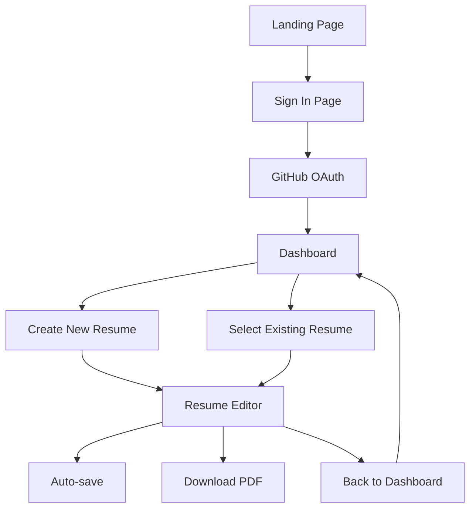
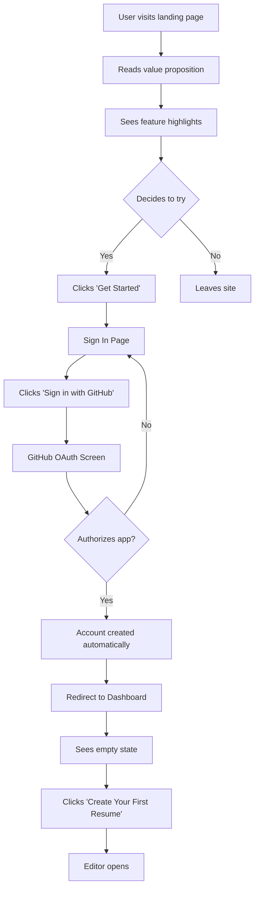
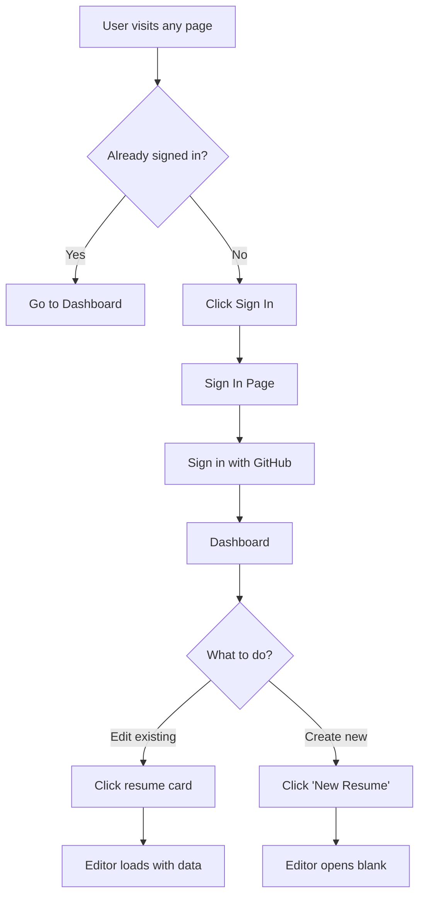
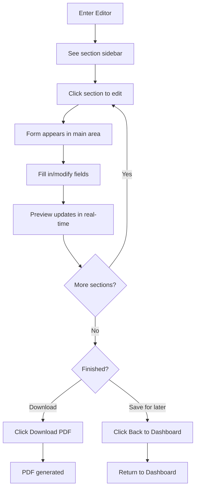
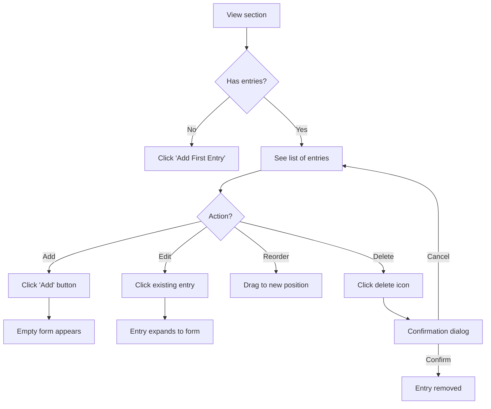
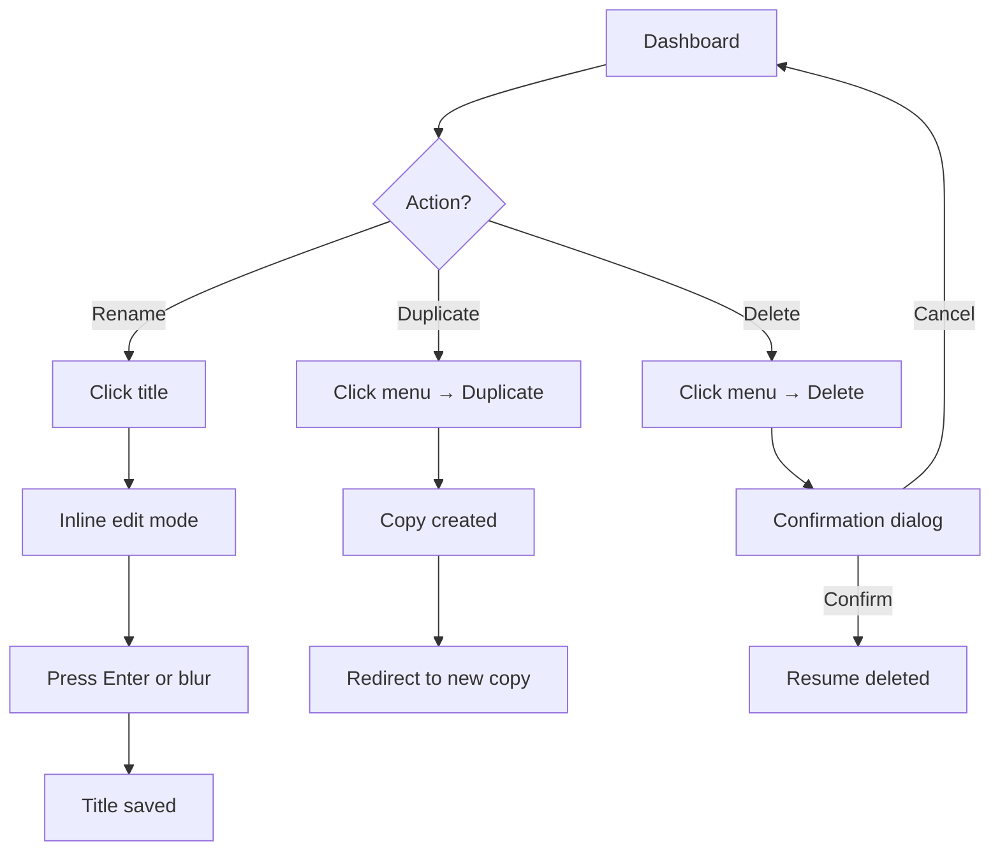
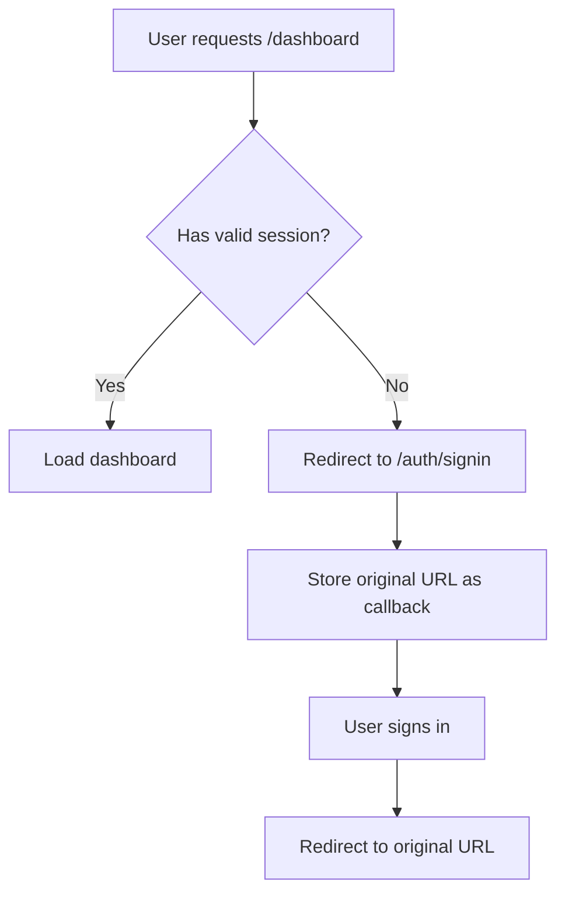
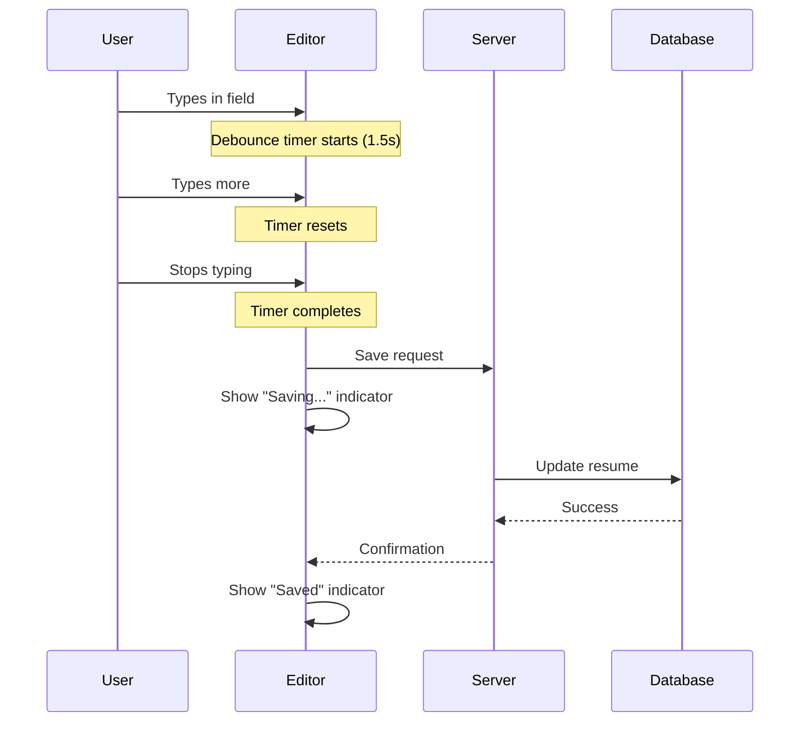
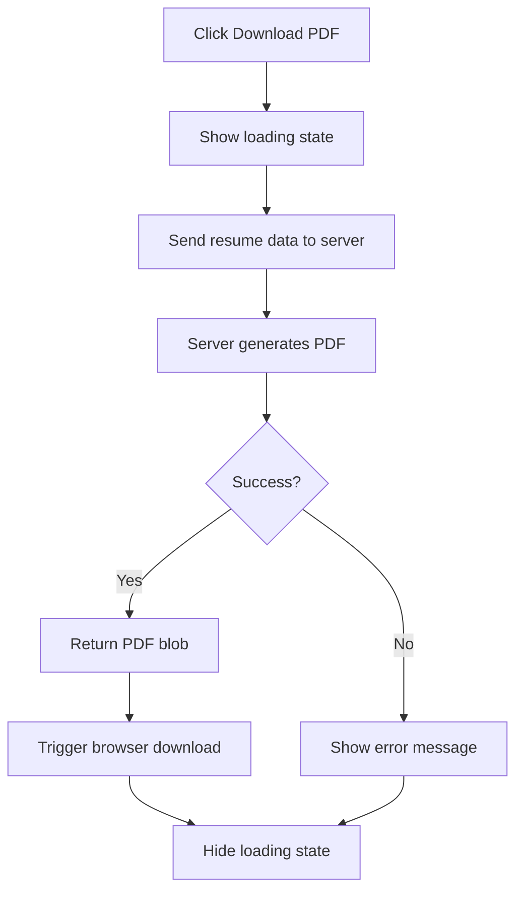

# User Flows

This document describes how users navigate through the ResumeBuilder2026 application.

## Flow Overview

## Detailed User Flows

### Flow 1: New User Journey

A first-time user discovering and signing up for the application.

**Steps:**

1. User lands on homepage
2. Reads the value proposition and feature list
3. Clicks "Get Started" or "Sign In" button
4. Redirected to sign-in page
5. Clicks "Sign in with GitHub"
6. Redirected to GitHub to authorize the application
7. After authorization, redirected back to the app
8. Account is created automatically using GitHub profile data
9. Redirected to dashboard showing empty state
10. Clicks "Create Your First Resume"
11. Enters the resume editor

### Flow 2: Returning User Journey

A user who already has an account returns to continue working.

**Steps:**

1. User visits the application
2. If not signed in, clicks "Sign In" in the navbar
3. Signs in with GitHub (no registration needed)
4. Redirected to dashboard showing existing resumes
5. Either clicks an existing resume to edit, or creates a new one

### Flow 3: Resume Editing Flow

The core experience of building a resume.

**Editor Sections:**

| Section | Description |
|---------|-------------|
| Contact Info | Name, email, phone, location, links |
| Summary | Professional summary paragraph |
| Experience | Work history entries |
| Education | Academic history entries |
| Skills | Skill tags |
| Projects | Portfolio project entries |

**For list sections (Experience, Education, Projects):**

### Flow 4: Resume Management

Managing resumes from the dashboard.

## Authentication States

How each page behaves based on authentication status.

| Page | Logged Out | Logged In |
|------|------------|-----------|
| `/` (Landing) | Show sign-in CTA | Show "Go to Dashboard" CTA |
| `/dashboard` | Redirect to `/auth/signin` | Show user's resumes |
| `/editor/[id]` | Redirect to `/auth/signin` | Load if owner, 404 if not |
| `/auth/signin` | Show sign-in options | Redirect to `/dashboard` |

### Protected Route Flow

## Edge Cases

| Scenario | Behavior |
|----------|----------|
| Visit `/editor/[id]` for resume you don't own | Show 404 page |
| Visit `/editor/[id]` that doesn't exist | Show 404 page |
| Session expires while editing | Show sign-in modal, preserve unsaved work |
| Delete your only resume | Show empty state with "Create" CTA |
| Try to access dashboard while logged out | Redirect to sign-in with callback URL |
| GitHub OAuth denied | Return to sign-in with error message |
| Network error while saving | Show error toast, retry option |

## Auto-Save Behavior

The editor uses debounced auto-save for seamless editing.

**Save indicators:**

| State | Display |
|-------|---------|
| No changes | Nothing shown |
| Unsaved changes | "Editing..." |
| Saving in progress | "Saving..." |
| Save successful | "Saved" (fades after 2s) |
| Save failed | "Failed to save" with retry button |

## PDF Export Flow

